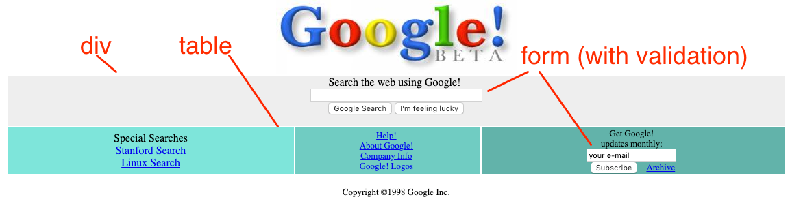

# Jours 5 - 8 HTML & HTML 5

Maintenant que vous avez vu les vidéos de ce chapitre, vous êtes prêt à commencer à expérimenter avec HTML & HTML 5. Mais ne vous inquiétez pas encore de la conception du site. Nous nous concentrerons sur les années 90 pour nos sites afin que les natifs aient l'impression de travailler pour nous.

## Jour 1 : Regardez les leçons en vidéo

Regardez les vidéos et notez les endroits où vous pourriez vouloir prendre des exemples. N'oubliez pas que vous avez tout ce que vous avez vu tapé dans le dossier demos adjacent à celui-ci si vous en avez besoin.

## Jours 2-3 : Recréer la page d'accueil de Google

Pour vos exercices pratiques au cours de ce chapitre, vous ferez quelque chose de rapide et de facile : recréer Google ! 

Alors que je me moquais de Yahoo ! parce qu'il n'était rien d'autre qu'une page jaune glamour, la technologie derrière Google était vraiment révolutionnaire à l'époque.

Mais leur design web n'avait rien de spécial. Regardez dans la machine à remonter le temps (choisissez 1998 pour votre période) :

[http://web.archive.org/web/19981202230410/http://www.google.com/](http://web.archive.org/web/19981202230410/http://www.google.com/)

Voici le design avec quelques notes visuelles sur ce qui est nécessaire pour chaque partie de la page (oui, les tableaux font un retour). Non vraiment, regardez la source, c'est les tableaux et même la balise centrale !



Votre travail consiste à recréer cette page d'accueil. N'hésitez pas à enregistrer le logo Google de la machine de retour en arrière pour votre page (clic droit, enregistrer l'image sous...). Ensuite, recréez la page d'accueil avec les formulaires et la validation selon le graphique ci-dessus.

Si vous n'êtes pas familier avec les tables HTML, voici un guide d'introduction :

```
<table border="0" width="90%">
	<tr>
		<td bgcolor="#EEEEEE">
			détails de la colonne ici...
		</td>
		<td bgcolor="#EEEEEE">
			détails de la colonne ici...
		</td>
		<td bgcolor="#EEEEEE">
			détails de la colonne ici...
		</td>
	</tr>
</table>
```


## Jour 4 : Ajouter un formulaire de connexion

Imaginez Google comme il est aujourd'hui, avec des services qui nécessitent un compte dédié. 

Élargissez votre page d'accueil Google de base pour y inclure une page d'enregistrement (lien vers un deuxième fichier HTML). Utilisez ce que vous avez appris sur la validation des entrées et les formulaires HTML pour construire le plus beau formulaire d'inscription possible sans vous soucier de la conception pour l'instant.

### Il est temps de partager ce que vous avez accompli !

N'oubliez pas de partager votre travail des deux derniers jours sur Twitter ou Facebook. Utilisez le hashtag **#100JoursFullstackWebPython**. 


Pensez à inclure [@martialobug](https://twitter.com/martialobug).

*Voir une erreur dans ces instructions ? Veuillez [soumettre un nouveau numéro](https://github.com/martialodev/100JoursFullstackWebPython/issues)*