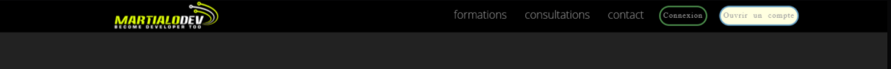

# Jours 13 - 16 : Les bases du CSS

Maintenant que vous avez vu les vidéos de ce chapitre, vous êtes prêts à commencer à explorer le monde du CSS.

## Jour 1 : Regardez les leçons en vidéo

Regardez les vidéos et notez les endroits où vous pourriez vouloir prendre des exemples. N'oubliez pas que vous avez tout ce que vous avez vu tapé dans le dossier demos adjacent à celui-ci si vous en avez besoin.

## Jours 2 : Jouer avec les sélecteurs

Aujourd'hui, vous pouvez jouer avec les sélecteurs CSS. Ceux-ci sont incroyablement importants car la façon dont vous ciblez les éléments dans les fichiers CSS consiste à spécifier les sélecteurs.

Ouvrez la section des sélecteurs de notre application de démonstration (à partir des vidéos). Elle est située à côté de ce foyer :

`013-016-les-bases-de-css/demos/selectors.html`

N'oubliez pas que vous pouvez simplement ouvrir ce répertoire de fichiers à partir de votre disque dur.

Utilisez la boîte de dialogue "Que puis-je utiliser" pour trouver des éléments intéressants à interroger et à mettre en évidence. Regardez le code source du fichier HTML pour trouver d'autres sélecteurs CSS intéressants à exécuter également.

## Jour 3 : Construire une navigation à partir d'un UL

Dans la partie Démonstration de la mise en page, vous avez vu que nous pouvons convertir une liste HTML en un élément de navigation en modifiant l'affichage et d'autres propriétés CSS.

Ce jour-là, utilisez une technique similaire pour convertir une liste d'hyperliens en éléments de navigation du site m :

- martialodev
- formations
- consultations
- contacts
- connexion
- ouvrir un compte
.

## Jour 4 : Thèmes de recherche Bootstrap

Bien que nous n'ayons pas eu le temps de couvrir [Bootstrap](https://getbootstrap.com/) et le riche écosystème thématique, il est très utile pour construire des applications web et accélérer le processus de conception.

Alors, cette journée, c'est pour rêver un peu. Imaginez une entreprise ou un produit cool que vous aimeriez créer un jour ou peut-être que votre entreprise travaille sur un projet mais que sa conception est médiocre. 

Alors visitez Wrap Bootstrap, un site à thème commercial :

[https://wrapbootstrap.com/](https://wrapbootstrap.com/)

Oui, il faudrait acheter ces thèmes, mais ils ne coûtent souvent que 20 dollars une fois pour toute la conception d'un site web. Votre objectif est de faire une recherche ici et de trouver 3 thèmes potentiels comme point de départ pour votre nouveau site web pour votre produit ou service.

Vous n'avez pas besoin de construire quoi que ce soit. Nous voulons juste que vous vous familiarisiez un peu avec l'idée des thèmes et du Bootstrap.

### Il est temps de partager ce que vous avez accompli !

N'oubliez pas de partager votre travail des deux derniers jours sur Twitter ou Facebook. Utilisez le hashtag **#100JoursFullstackWebPython**. 

.Pensez à inclure [@martialobug](https://twitter.com/martialobug)

*Voir une erreur dans ces instructions ? Veuillez [soumettre un nouveau numéro](https://github.com/martialodev/100JoursFullstackWebPython/issues) 

